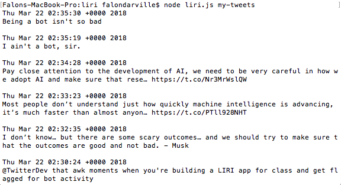
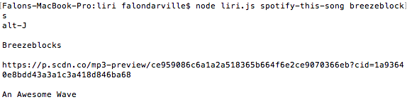
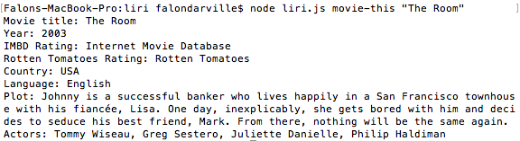
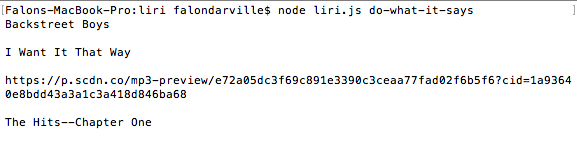

# LIRI Application

This Language Interpretation and Recognition Interface (LIRI) takes the following commands through the Terminal: 

1. my-tweets 
	This prints out the last 20 tweets from a mock Twitter account I made.

2. spotify-this-song <song name>
	This prints out the name, artists, spotify preview link, and album that the song is from. 

3. movie-this <movie name>
	This prints out the movie title, year, IMDB rating, Rotten Tomatoes rating, country, language, plot, and actors. 

4. do-what-it-says
	This prints out a command listed on the random.txt file. 

### Technologies used:

JavaScript, APIs, Node

